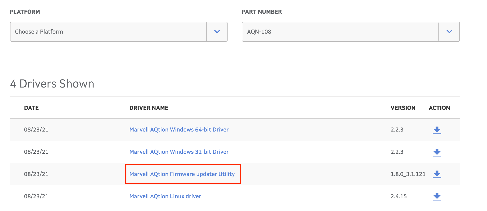
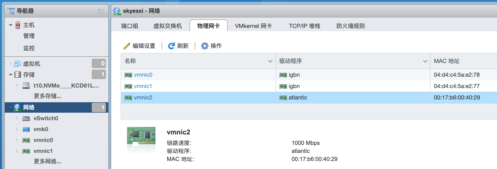

### 发现原因

在日志文件 `/var/log/vmkernel.log` 中发现一行记录：

```bash
2021-08-23T17:27:36.834Z cpu24:2097768)atlantic: Claiming PCI device [0x1d6a:0xd108 0x0001:0x1d6a]                              
2021-08-23T17:27:36.834Z cpu24:2097768)VMK_PCI: 773: device 0000:06:00.0 pciBar 0 bus_addr 0x92840000 size 0x10000                    
2021-08-23T17:27:37.149Z cpu24:2097768)ALERT: atlantic: 0000:06:00.0 Fw version 105003a is not supported  
```

这应该是表示网卡的固件版本（太低）而不被 atlantic 驱动支持。

### 刷新固件

打开 Marvell 的官方网站，进入驱动下载页面：

[Support | Driver Downloads | - Marvell](https://www.marvell.com/support/downloads.html)

"Part Number" 选择 "AQN-108"，在显示出来的驱动内容中找到 "firmware updater utility"，下载下来 `MarvellFlashUpdate_v1.8.0_3.1.121.zip` ：



参照 readme.txt 中的详细说明，在 windows 下刷新 aqn-108 的固件为最新版本。

>  备注：在这里也可以下载到这个网卡最新的windows和linux驱动。

### 重新启动

重启 esxi，就能正确的识别并驱动 aqn-108 网卡了。

```
2021-08-23T23:15:51.798Z cpu14:2097707)atlantic: 0000:06:00.0 DefQRss: 0x1, NetQueue: 0x1                                 
2021-08-23T23:15:51.798Z cpu14:2097707)atlantic: 0000:06:00.0 rss queues: 8                                               
2021-08-23T23:15:51.798Z cpu14:2097707)atlantic: 0000:06:00.0 net queues: 2                                               
2021-08-23T23:15:51.798Z cpu14:2097707)VMK_PCI: 622: device 0000:06:00.0 allocated 11 MSIX interrupts             
2021-08-23T23:15:51.798Z cpu14:2097707)DMA: 687: DMA Engine 'atlantic' created using mapper 'DMANull'.
2021-08-23T23:15:51.798Z cpu14:2097707)Device: 400: Found driver atlantic for device 0x62cf43070480587c

2021-08-23T23:15:51.259Z cpu14:2097707)Elf: 2060: module atlantic has license ThirdParty                                  
2021-08-23T23:15:51.259Z cpu9:2097703)CpuSched: 817: user latency of 2097710 tq:vmknvmeTimerQueue 0 changed by 2097703 vmk
2021-08-23T23:15:51.259Z cpu9:2097703)NVMEMOD:1044 Module vmknvme initialized successfully.                               
2021-08-23T23:15:51.259Z cpu9:2097703)NVMEMOD:1052 NVMF initialized successfully.                                         
2021-08-23T23:15:51.259Z cpu9:2097703)Device: 211: Registered driver 'nvmeBusDriver' from 44                              
2021-08-23T23:15:51.259Z cpu9:2097703)NVMEMOD:1060 Driver vmknvme registered successfully.                                
2021-08-23T23:15:51.259Z cpu9:2097703)Mod: 4789: Initialization of vmknvme succeeded with module ID 44.                   
2021-08-23T23:15:51.259Z cpu9:2097703)vmknvme loaded successfully.                                                        
2021-08-23T23:15:51.260Z cpu9:2097703)Loading module nvme_pcie ...                                                        
2021-08-23T23:15:51.265Z cpu1:2097704)Elf: 2060: module vmkbsd has license VMware                                         
2021-08-23T23:15:51.271Z cpu14:2097707)Device: 211: Registered driver 'atlantic' from 45                                  
2021-08-23T23:15:51.271Z cpu14:2097707)Mod: 4789: Initialization of atlantic succeeded with module ID 45.
2021-08-23T23:15:51.271Z cpu14:2097707)atlantic loaded successfully.  
```

控制台上也可以在 "物理网卡" 中看到这张 aqn-108 网卡：



### 后记

反省一下，二十年diy生涯，今天第一次刷网卡固件，汗，见识太少一下子没反应过来网卡也有固件。。。

思维定势，我从来没有玩过高级网卡，甚至都不知道还有网卡固件这回事，导致我没有往这里去想。

后面HP 544+ 网卡到货，第一时间开始刷最新固件。