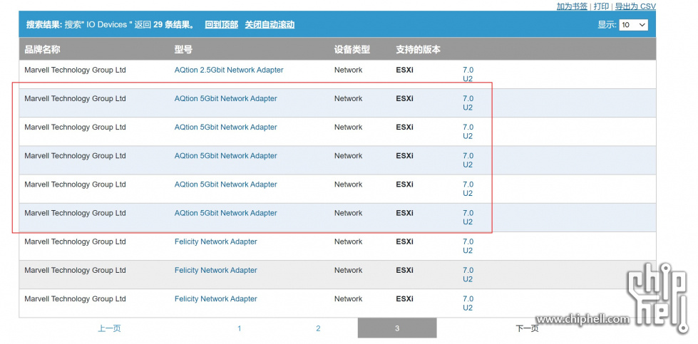
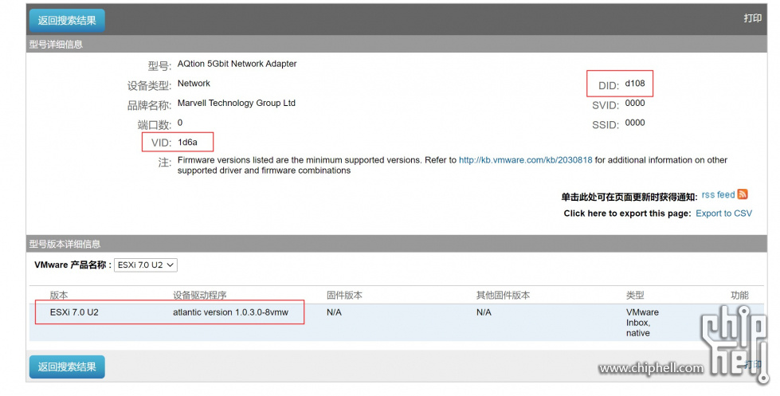
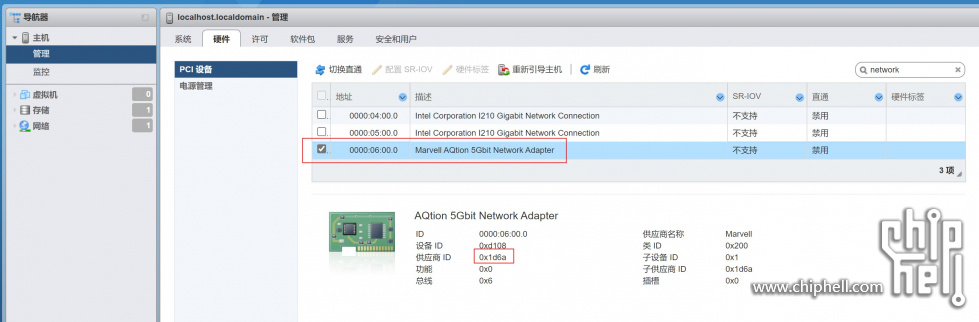
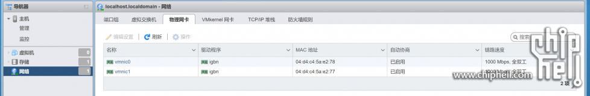

给 esxi 主机上加了一个新的 AQuantia aqn-108 5g（5千兆）有线网卡，这个机器的主板原来自带有两个 intel i210 千兆网卡。新加的准备 aqn-108 网卡是准备和另外一台机器做双机直连用。

## 准备工作

找了一下 AQuantia 网卡的支持，看到最新的消息是从 esxi 7.0.2 （update 2）版本之后就原生自带驱动了。

[https://williamlam.com/2021/03/a ... i-7-0-update-2.html](https://williamlam.com/2021/03/aquantia-marvell-aqtion-atlantic-driver-now-inbox-in-esxi-7-0-update-2.html)

在兼容性列表中我找到了对这个网卡的支持，按照设备ID不同列出了5个，其中第一个设备ID为 d108 就是我目前正在用的设备：



设备ID "d108" 的详细信息：




## 问题描述

**Aqn-108 网卡在esxi 7.0 u2 中无法工作。**

esxi 已经升级到 7.0 U2:

```bash
vmware -l
VMware ESXi 7.0 Update 2
```

软件列表中存在要求的 atlantic ，版本 1.0.3.0-8vmw 也和支持列表中要求的版本一致：

```
esxcli software vib list
Name                           Version                              Vendor  Acceptance Level  Install Date
-----------------------------  -----------------------------------  ------  ----------------  ------------
atlantic                       1.0.3.0-8vmw.702.0.0.17867351        VMW     VMwareCertified   2021-08-23
```

lspci 命令能列出来三张网卡，其中 vmnic2 供应商和设备ID 1d6a:d108 和这块网卡的信息是一致的，说明网卡识别到了：

```bash
 lspci -v | grep vmnic
 
0000:04:00.0 Network controller Ethernet controller: Intel Corporation I210 Gigabit Network Connection [vmnic0]
0000:05:00.0 Network controller Ethernet controller: Intel Corporation I210 Gigabit Network Connection [vmnic1]
0000:06:00.0 Network controller Ethernet controller: Marvell AQtion 5Gbit Network Adapter [vmnic2]
```

下面的命令也能找到 aqn-108 网卡：

```bash
vmkvsitools lspci -p | grep vmnic

Segm:Bu:De.F Vend:Dvid Subv:Subd ISA/irq/Vect P M Module       Name    
0000:04:00.0 8086:1533 1043:8557 255/   /     A V igbn         vmnic0
0000:05:00.0 8086:1533 1043:8557 255/   /     A V igbn         vmnic1
0000:06:00.0 1d6a:d108 1d6a:0001 255/   /     A V              vmnic2
```

pci 设备中是可以看到这个 aqn-108 网卡的，供应商ID和设备ID都吻合：



但在物理网卡列表中却没有这个网卡：



用命令查出来 network nic也是如此：

```
esxcli network nic list
Name    PCI Device    Driver  Admin Status  Link Status  Speed  Duplex  MAC Address         MTU  Description
------  ------------  ------  ------------  -----------  -----  ------  -----------------  ----  -----------
vmnic0  0000:04:00.0  igbn    Up            Up            1000  Full    04:d4:c4:5a:e2:78  1500  Intel Corporation I210 Gigabit Network Connection
vmnic1  0000:05:00.0  igbn    Up            Up            1000  Full    04:d4:c4:5a:e2:77  1500  Intel Corporation I210 Gigabit Network Connection
```

## 尝试解决问题

### 升级到7.0.2

原来的版本是7.0.0，升级到7.0.2。结果遇到上面的问题无法识别。

### 手工安装驱动

参考这里的描述

- https://github.com/Aquantia/AQtion-esxi/issues/18

手工安装 atlantic 驱动，期待原生的驱动（原生驱动反而版本更新）：

```
esxcli software vib install -d /vmfs/volumes/61090e61-7519507d-1c82-04d4c45ae278/MRVL-Atlantic-Driver-Bundle_1.0.2.0-1OEM.670.0.0.8169922-offline-bundle-16081713.zip

Installation Result
   Message: The update completed successfully, but the system needs to be rebooted for the changes to be effective.
   Reboot Required: true
   VIBs Installed: MRVL_bootbank_atlantic_1.0.2.0-1OEM.670.0.0.8169922
   VIBs Removed: VMW_bootbank_atlantic_1.0.3.0-8vmw.702.0.0.17867351
   VIBs Skipped: 
```

问题依旧，能看到硬件，但就是无法出现在物理网卡列表中。 

### 重新安装esxi

重新安装esxi，选择最新的 7.0.2，安装完成之后发现问题还是存在，排除升级出问题的可能。