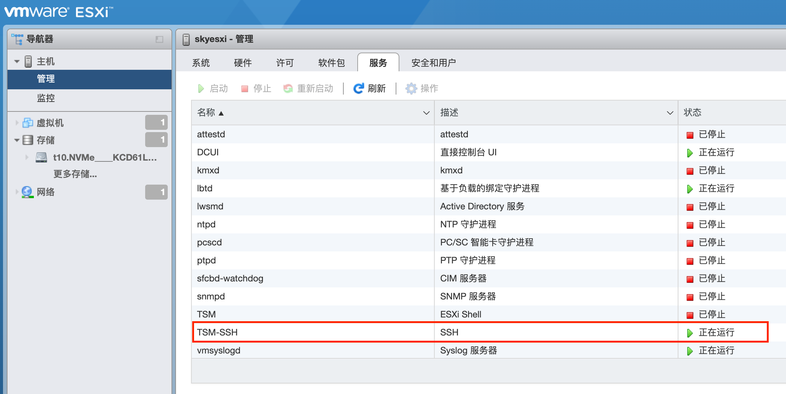
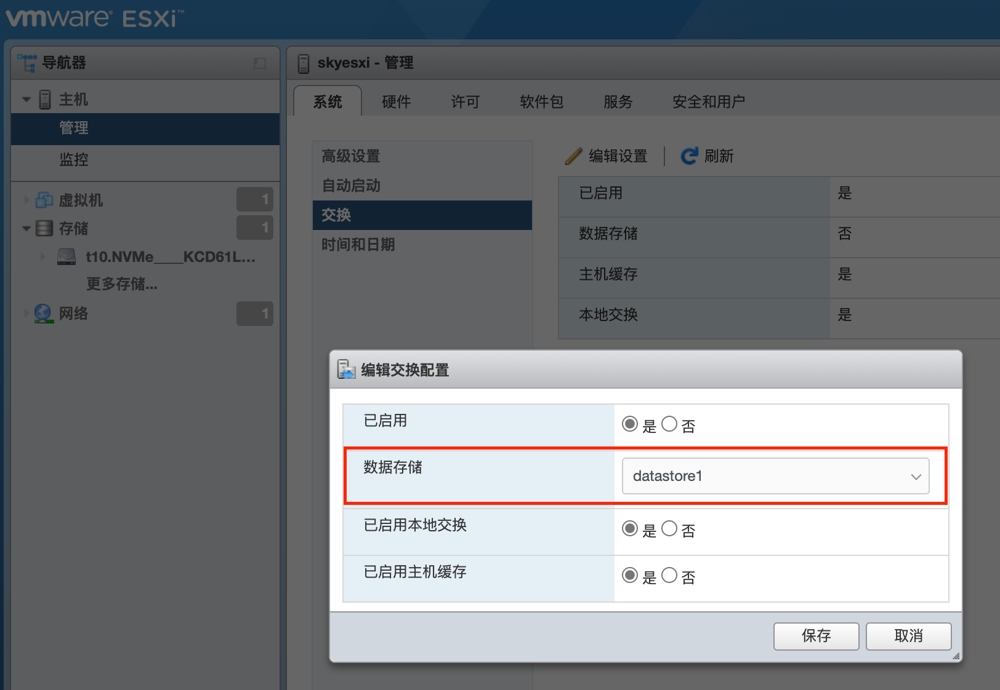
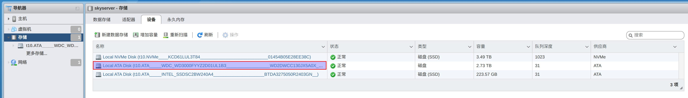

## 在主机界面上进行配置

### 设置控制台的IP地址

主板自带两块intel千兆网卡，mac地址分别是：

- 04:d4:c4:5a:e2:77
- 04:d4:c4:5a:e2:78

在路由器的dhcp中手工指定这两个网卡的IP地址，分别为 192.168.0.40 和 192.168.0.41 

在 esxi 主机的界面上（不是web页面）上，按 F2 Customize System/View Logs，输入root密码。

选择 "Configuration Management Network" -> "Network Adapter"，选择mac地址为 "04:d4:c4:5a:e2:77" 的网卡。如果默认选择的是另外一块网卡，注意取消勾选。

"Restart management network" 之后，就可以使用 192.168.0.40 这个IP地址访问 exsi 控制台了。

### 设置esxi主机的hostname

同样在 "Configuration Management Network" 选择 "DNS Configuration"，设置：

- Primary DNS Server: 192.168.0.1
- Hostname: skyserver

再次 "Restart management network" 即可生效。

## 使用控制台进行配置

用上面的IP地址 192.168.0.40，登录控制台页面。

### 开启ssh

登录 esxi web管理界面，进入 "管理" --> "服务"，在列表中找到 TSM-SSH，右键点启动。

也可以在策略中选择"随主机启动和停止"。

### 设置swap

登录 esxi web管理界面，进入 "管理" --> "系统" --> "交换"，点击"编辑设置"。

数据存储下拉框中选择需要使用的 datastore：

设置好之后需要重启 esxi 主机。

### 新增数据存储

为了方便备份数据，增加了一块闲置的3T容量的普通机械硬盘。

进入 "存储" -> "设备"，可以看到当前的存储设备：

点击这块硬盘，选择"操作" -> "清除分区表"。

再点击"新增数据存储"，选择这块硬盘（注意如果没有删除分区表，会显示没有空闲的设备可以添加）。

