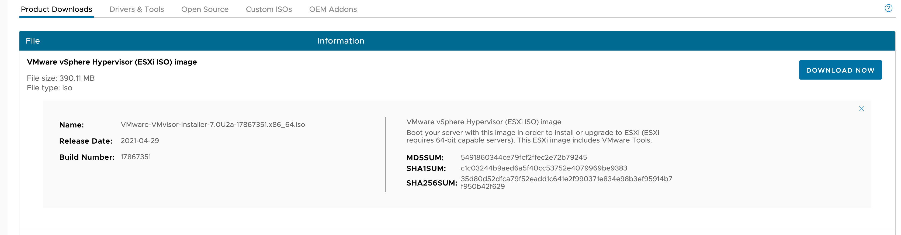

## 准备工作

### 硬件准备

准备了一台性能还可以的物理机器：

- cpu：intel 7960x
- 主板：华硕 x299 ws pro/se
- 内存：32g * 4 @ddr4 3600
- 显卡：amd r5 240 亮机卡
- 硬盘：
  - 一块256g sata ssd安装windows10以备不时之需
  - 一块3.94t的服务器u2接口的nvme ssd用来给esxi使用
- 网卡
  - 主板自带两个intel i210 千兆网卡，连接在千兆交换机上，可以访问外网
  - 一块 aqn-108 五千兆网卡，用网线和另外一台开发主机（同样也有一个五千兆网卡）直连，不走交换机
  - （计划）HP 544+ 40G网卡一对，分别插在 esxi 主机和开发主机上，也是直连

### 软件准备

从vmware官方下载页面下载 esxi 的最新版本 7.0.2：

[Download VMware vSphere - VMware Customer Connect](https://customerconnect.vmware.com/en/downloads/details?downloadGroup=ESXI70U2A&productId=974&rPId=71227)

> 备注
>
> 1. 默认下载速度超级的慢，几K几K的速度，剩余2-3天，无法忍受。
>
> 2. 由于vmware网站没有被墙，所以一般不会自动开启代理，因此需要在科学上网软件中设置全局代理或者手动将vmware.com网站设置为启用代理，之后便可以用几M的速度下载。
>
> 3. 在 clash 中可以在控制面板临时将规则 "漏网之鱼" 从默认的 DIRECT 设置为 总模式，先临时启用，待下载完成之后再恢复为 DIRECT。

也可以在一些整理好的网站上下载：

- [VMware常用软件ISO下载汇总](https://www.dinghui.org/vmware-iso-download.html)

然后刻录启动U盘。

{}
- balenaEtcher 有mac版本，但是刻录出来的u盘无法启动
- 在windows下用 rufus 刻录，刻录中提示要下载文件以提供支持时选择同意
{}

## 安装

从u盘启动，然后按照提示一路安装，没有什么特别。

### 默认虚拟闪存的调整

在全新安装ESXI 7后，系统默认将会在数据存储中划分120G空间作为虚拟闪存。我目前硬盘足够大所以不介意这点占用。如果敏感则可以在安装过程中进行调整。

> 参考：虚拟闪存的作用
> 
> 利用虚拟闪存可以通过使用本地 SSD 磁盘（为 ESXi 主机上运行的所选虚拟机提供闪存缓存）提高虚拟机性能。Virtual Flash Read Cache 可以为对延迟极度敏感的应用程序提供低延迟，从而使之前认为 I/O 过于密集因而似乎不可能实现虚拟化的一些计算机系统/应用程序实现虚拟化。
> 

参考：

- [vSphere 5.5 中的虚拟闪存功能](https://kb.vmware.com/s/article/2058983?lang=zh_CN) 
- [VMware ESXi 7.0 自定义「虚拟闪存」容量拯救小磁盘 - VVavE](https://www.vvave.net/archives/change-the-default-size-of-the-esx-osdata-volume-in-esxi-seven.html)
- [完美移除ESXI 7.0默认120G虚拟闪存，并支持自由调整，释放被占用的磁盘空间_Hewitt的博客-CSDN博客](https://blog.csdn.net/qiaohewei/article/details/108622880)

