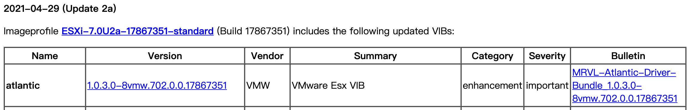
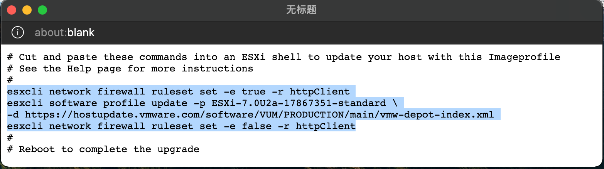
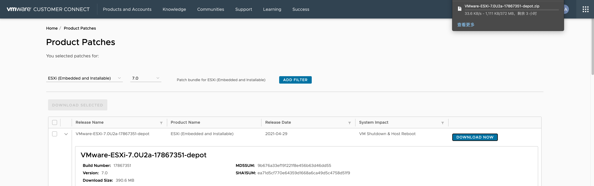
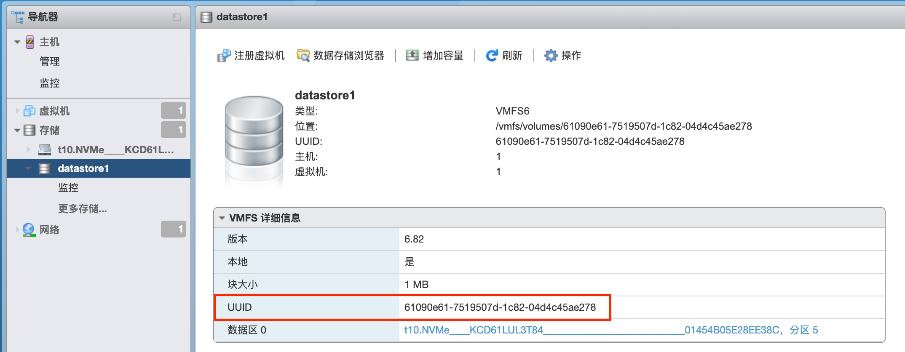
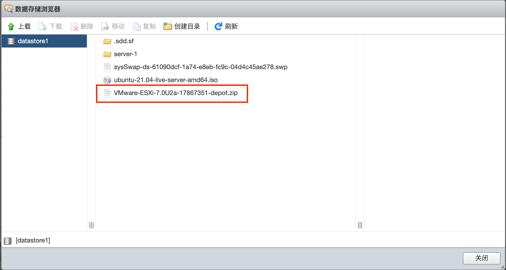
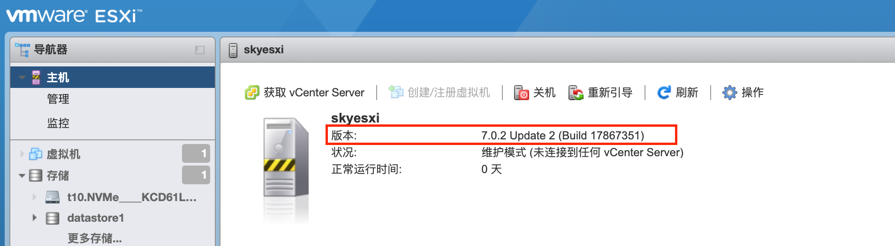

给 exsi 打补丁以升级版本。

## 在线升级

在 google 中搜索 `exsi patch`，找到 [VMware ESXi 7.0 Patch History (v-front.de)](https://esxi-patches.v-front.de/) 的网站，选择最新的patch：



点击之后会弹出一个窗口，提示更新补丁的命令如下：



需要用到的命令有三个：

```
esxcli network firewall ruleset set -e true -r httpClient
esxcli software profile update -p ESXi-7.0U2a-17867351-standard -d https://hostupdate.vmware.com/software/VUM/PRODUCTION/main/vmw-depot-index.xml
esxcli network firewall ruleset set -e false -r httpClient
```

### 报错

如果遇到报错 MemoryError ，则应该是esxi "设置swap" 的步骤没有做或者没有重启： 

```
 [MemoryError]
 Please refer to the log file for more details.
```

如果报错 "Got no data from process":

```
Got no data from process: LANG=en_US.UTF-8 /usr/lib/vmware/esxcli-software profile.update  -d "https://hostupdate.vmware.com/software/VUM/PRODUCTION/main/vmw-depot-index.xml" -p "ESXi-7.0U2a-17867351-standard"  
```

没有找到解决的办法，一般建议离线升级。

- [Solved: esxcli software profile update fails with "Got no ... - VMware Technology Network VMTN](https://communities.vmware.com/t5/ESXi-Discussions/esxcli-software-profile-update-fails-with-quot-Got-no-data-from/td-p/2847478)
- [How to update any VMware ESXi Hypervisor to the latest using ESXCLI for easy download and install | TinkerTry IT @ Home](https://tinkertry.com/easy-update-to-latest-esxi#apr-14-2019-update)

## 离线升级

### 下载升级文件

下载离线升级文件：

[Product Patches - VMware Customer Connect](https://customerconnect.vmware.com/patch/)

选择 esxi 7.0 版本（注意不是7.0.0或者7.0.1），找到 `VMware-ESXi-7.0U2a-17867351-depot` ，开始下载。



> 备注
>
> 1. 默认下载速度超级的慢，最好能科学上网或者找到他人整理好的补丁包。
>

### 上传离线文件到exsi主机

将文件上传到 exsi 主机的存储上，在控制台进入 "存储" --> "datastore1" ，注意这里的UUID，后面会用到：



点 "数据存储浏览器" 就能看到当前已有的文件。点击 "上载" 选择 `VMware-ESXi-7.0U2a-17867351-depot.zip` 文件。



### 离线升级

ssh登录 esxi 主机，运行 `vmware -l` 命令看一下当前 exsi 的版本，如我当前是 7.0 GA 版本

```bash
VMware ESXi 7.0 GA
```

先让 esxi 主机进入维护模式，也可以在控制台页面操作：

```bash
esxcli system maintenanceMode set -e true
Maintenance mode is already enabled.
```

之后执行更新命令：

```bash
esxcli software profile update -p ESXi-7.0U2a-17867351-standard -d /vmfs/volumes/61090e61-7519507d-1c82-04d4c45ae278/VMware-ESXi-7.0U2a-17867351-depot.zip
```

注意：这里的路径 `/vmfs/volumes/61090e61-7519507d-1c82-04d4c45ae278/` 中的 `61090e61-7519507d-1c82-04d4c45ae278` 就是前面看到的 datastore 的 UUID。

等待大概20秒就可以看到更新成功的提示信息：

```bash
Update Result
   Message: The update completed successfully, but the system needs to be rebooted for the changes to be effective.
   Reboot Required: true
   VIBs Installed: VMW_bootbank_atlantic_1.0.3.0-8vmw.702.0.0.17867351, VMW_bootbank_bnxtnet_216.0.50.0-34vmw.702.0.0.17867351, VMW_bootbank_bnxtroce_216.0.58.0-19vmw.702.0.0.17867351, VMW_bootbank_brcmfcoe_12.0.1500.1-2vmw.702.0.0.17867351, 
   ............
   VIBs Skipped: 
```

完成之后执行命令重启 exsi 主机：

```bash
boot
```

### 验证升级结果

exsi 启动时，界面上显示为 "vmware exsi 7.0.2 (vmkernel release build 17867351)" ，这说明已经更新成功。

登录控制台，在 "主机" 页面上 可以看到当前版本：



由于升级之前将主机设置为维护模式了，所以现在还要再修改为正常模式。可以通过控制台执行，点击 "操作" --> "推出维护模式"，或者ssh之后执行命令

```
esxcli system maintenanceMode set -e false
```

参考文章：

- [HOW TO: Update VMware ESXi 7.0U2 to ESXi 7.0U2a in 5 easy steps | Experts Exchange (experts-exchange.com)](https://www.experts-exchange.com/articles/36038/HOW-TO-Update-VMware-ESXi-7-0U2-to-ESXi-7-0U2a-in-5-easy-steps.html)

  

