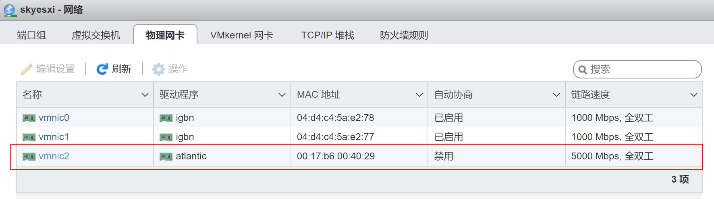
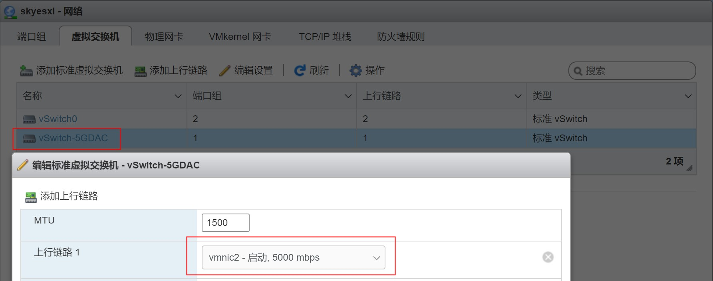
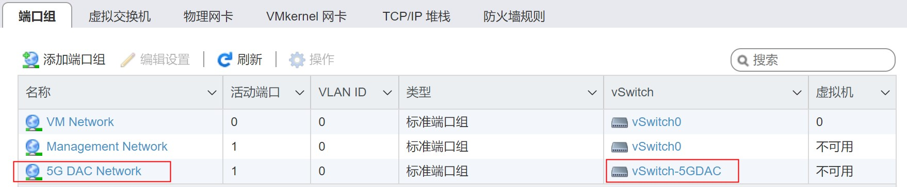
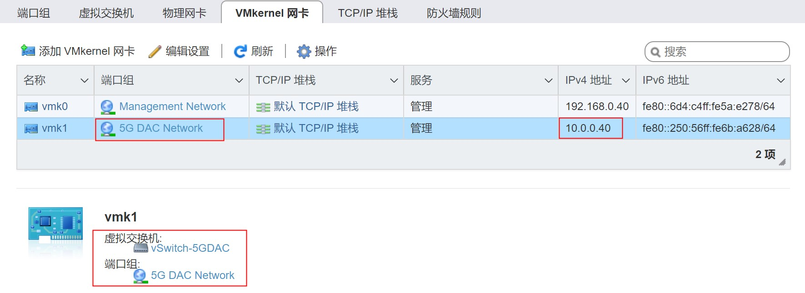
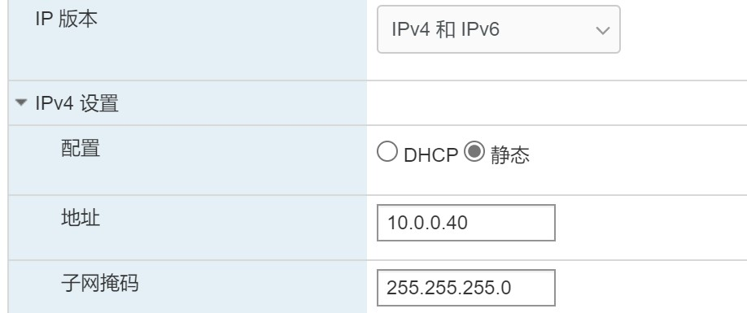
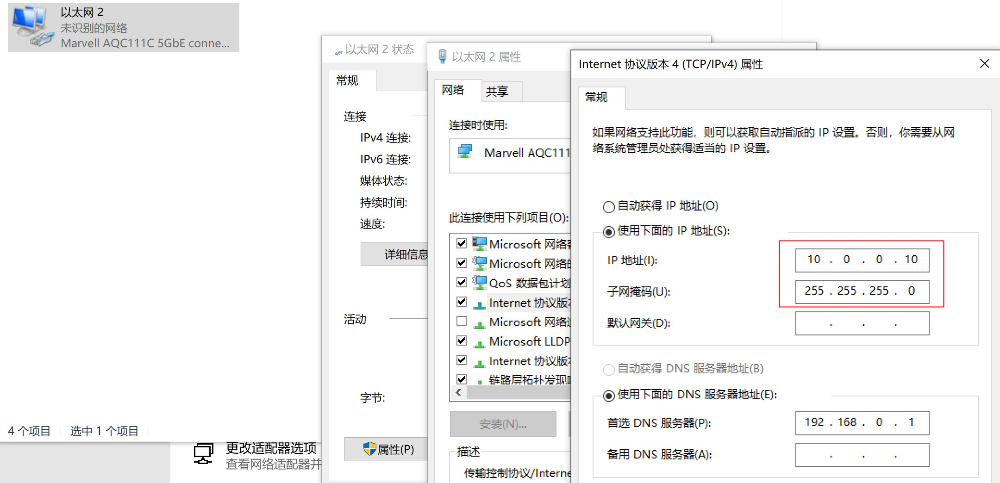

## 准备软件

### 在esxi7上准备iperf3

esxi 7 自带 iperf3，位于 `/usr/lib/vmware/vsan/bin/iperf3`，使用时注意先执行以下命令：

```bash
cp /usr/lib/vmware/vsan/bin/iperf3 /usr/lib/vmware/vsan/bin/iperf3.copy
```

复制一份作为服务器端使用，否则直接通过 iperf3 运行服务器端，会报错：

```bash
/usr/lib/vmware/vsan/bin/iperf3 -s -B 192.168.0.40
iperf3: error - unable to start listener for connections: Operation not permitted
iperf3: exiting
```

关于这一点请参考：

- [Quick Tip - iPerf now available on ESXi (williamlam.com)](https://williamlam.com/2016/03/quick-tip-iperf-now-available-on-esxi.html)

另外测试之前关闭esxi的防火墙：

```bash
esxcli network firewall set --enabled false
```

### 在windows10上准备iperf3

从 iperf 官方网站上下载 iperf3：

[iPerf - Download iPerf3 and original iPerf pre-compiled binaries](https://iperf.fr/iperf-download.php#windows)

## 准备网络

### 网络连接概述

两台机器之间一共有三组网络连接：

1. 千兆网络：esxi主机和开发机器之间通过千兆交换机连接，都是千兆有线网卡， ip地址设置为 192.168.0.10 和 192.168.0.40
2. 五千兆高速网络：esxi主机上插一块 aqn-108 五千兆网卡（支持windows、linux和exsi），开发机器主板自带一块 aqn-111c 五千兆网卡（支持windows、linux，不支持黑苹果），通过网线直连，ip地址设置为 10.0.0.10 和 10.0.0.40
3. 40G超高速网络：esxi主机上插一块 hp 544+ 40G网卡（支持windows、linux，exsi不确定），开发机器同样插一块 hp 544+ 40G网卡（支持windows、linux，黑苹果不确定），通过40G QSFP网线直连，ip地址设置为 192.168.1.10 和 192.168.1.40

### esxi网络设置

#### 5G网络设置

首先确保5G物理网卡已经识别，链路速度为5000Mbps，全双工。



开始创建5g网络的虚拟交换机，上行链路选择上面的5g网卡：



再添加5g的端口组，虚拟交换机选择前面创建的5g交换机：



最后在vmkernel网卡中添加一个vmkernel网卡：



ip地址的设置为：



### windows网络设置

#### 5G网络设置

5g网卡的适配器设置如下：




## 测试

### esxi7作为服务器端

#### 测试千兆网络

服务器端 esxi ip地址为 192.168.0.40：

```bash
 /usr/lib/vmware/vsan/bin/iperf3.copy -s -B 192.168.0.40
-----------------------------------------------------------
Server listening on 5201
-----------------------------------------------------------
```

客户端为windows10，启动iperf3.exe，走千兆网络，带宽接近千兆的：

```
iperf3.exe -n 1000M -c 192.168.0.40
Connecting to host 192.168.0.40, port 5201
[  4] local 192.168.0.10 port 65066 connected to 192.168.0.40 port 5201
[ ID] Interval           Transfer     Bandwidth
[  4]   0.00-1.00   sec   110 MBytes   923 Mbits/sec
[  4]   1.00-2.00   sec   110 MBytes   921 Mbits/sec
[  4]   2.00-3.00   sec   109 MBytes   917 Mbits/sec
[  4]   3.00-4.00   sec   110 MBytes   918 Mbits/sec
[  4]   4.00-5.00   sec   109 MBytes   918 Mbits/sec
[  4]   5.00-6.00   sec   110 MBytes   919 Mbits/sec
[  4]   6.00-7.00   sec   108 MBytes   902 Mbits/sec
[  4]   7.00-8.00   sec   109 MBytes   918 Mbits/sec
[  4]   8.00-9.00   sec   110 MBytes   918 Mbits/sec
[  4]   9.00-9.15   sec  16.0 MBytes   910 Mbits/sec
- - - - - - - - - - - - - - - - - - - - - - - - -
[ ID] Interval           Transfer     Bandwidth
[  4]   0.00-9.15   sec  1000 MBytes   917 Mbits/sec                  sender
[  4]   0.00-9.15   sec  1000 MBytes   917 Mbits/sec                  receiver

iperf Done.
```

#### 测试五千兆网络

服务器端 esxi ip地址为 10.0.0.40：

```bash
 /usr/lib/vmware/vsan/bin/iperf3.copy -s -B 10.0.0.40
-----------------------------------------------------------
Server listening on 5201
-----------------------------------------------------------
```

客户端为windows10，启动iperf3.exe，走五千兆直连网络，单线程带宽只有2g多一点：

```bash
iperf3.exe -n 5000M -c 10.0.0.40
Connecting to host 10.0.0.40, port 5201
[  4] local 10.0.0.10 port 63397 connected to 10.0.0.40 port 5201
[ ID] Interval           Transfer     Bandwidth
[  4]   0.00-1.00   sec   244 MBytes  2.05 Gbits/sec
[  4]   1.00-2.00   sec   251 MBytes  2.11 Gbits/sec
[  4]   2.00-3.00   sec   254 MBytes  2.13 Gbits/sec
[  4]   3.00-4.00   sec   251 MBytes  2.11 Gbits/sec
[  4]   4.00-5.00   sec   263 MBytes  2.20 Gbits/sec
[  4]   5.00-6.00   sec   257 MBytes  2.15 Gbits/sec
[  4]   6.00-7.00   sec   259 MBytes  2.17 Gbits/sec
[  4]   7.00-8.00   sec   263 MBytes  2.20 Gbits/sec
[  4]   8.00-9.00   sec   273 MBytes  2.29 Gbits/sec
[  4]   9.00-10.00  sec   265 MBytes  2.23 Gbits/sec
[  4]  10.00-11.00  sec   266 MBytes  2.23 Gbits/sec
[  4]  11.00-12.01  sec   252 MBytes  2.10 Gbits/sec
[  4]  12.01-13.00  sec   262 MBytes  2.22 Gbits/sec
[  4]  13.00-14.00  sec   273 MBytes  2.29 Gbits/sec
[  4]  14.00-15.00  sec   264 MBytes  2.21 Gbits/sec
[  4]  15.00-16.00  sec   268 MBytes  2.25 Gbits/sec
[  4]  16.00-17.00  sec   262 MBytes  2.20 Gbits/sec
[  4]  17.00-18.00  sec   261 MBytes  2.19 Gbits/sec
[  4]  18.00-19.00  sec   260 MBytes  2.18 Gbits/sec
[  4]  19.00-19.19  sec  52.1 MBytes  2.27 Gbits/sec
- - - - - - - - - - - - - - - - - - - - - - - - -
[ ID] Interval           Transfer     Bandwidth
[  4]   0.00-19.19  sec  4.88 GBytes  2.19 Gbits/sec                  sender
[  4]   0.00-19.19  sec  4.88 GBytes  2.19 Gbits/sec                  receiver

iperf Done.
```

通过 `-P` 参数指定多线程，可以使用更大的带宽，实测下来：

- 单线程带宽2.2g
- 两个线程带宽3.5g
- 三个线程带宽3.3g
- 四个线程带宽4.7g
- 再往上加线程带宽还是4.7g

```bash
iperf3.exe -c 10.0.0.40 -t 20 -P 5
Connecting to host 10.0.0.40, port 5201
[  4] local 10.0.0.10 port 54228 connected to 10.0.0.40 port 5201
[  6] local 10.0.0.10 port 54230 connected to 10.0.0.40 port 5201
[  8] local 10.0.0.10 port 54231 connected to 10.0.0.40 port 5201
[ 10] local 10.0.0.10 port 54232 connected to 10.0.0.40 port 5201
[ 12] local 10.0.0.10 port 54233 connected to 10.0.0.40 port 5201
[ ID] Interval           Transfer     Bandwidth
[  4]   0.00-1.00   sec   106 MBytes   891 Mbits/sec
[  6]   0.00-1.00   sec   106 MBytes   890 Mbits/sec
[  8]   0.00-1.00   sec   106 MBytes   886 Mbits/sec
[ 10]   0.00-1.00   sec   125 MBytes  1.05 Gbits/sec
[ 12]   0.00-1.00   sec   123 MBytes  1.03 Gbits/sec
[SUM]   0.00-1.00   sec   567 MBytes  4.75 Gbits/sec
......
[ ID] Interval           Transfer     Bandwidth
[  4]   0.00-8.58   sec   921 MBytes   900 Mbits/sec                  sender
[  4]   0.00-8.58   sec  0.00 Bytes  0.00 bits/sec                  receiver
[  6]   0.00-8.58   sec   918 MBytes   897 Mbits/sec                  sender
[  6]   0.00-8.58   sec  0.00 Bytes  0.00 bits/sec                  receiver
[  8]   0.00-8.58   sec   912 MBytes   891 Mbits/sec                  sender
[  8]   0.00-8.58   sec  0.00 Bytes  0.00 bits/sec                  receiver
[ 10]   0.00-8.58   sec  1.04 GBytes  1.04 Gbits/sec                  sender
[ 10]   0.00-8.58   sec  0.00 Bytes  0.00 bits/sec                  receiver
[ 12]   0.00-8.58   sec  1023 MBytes   999 Mbits/sec                  sender
[ 12]   0.00-8.58   sec  0.00 Bytes  0.00 bits/sec                  receiver
[SUM]   0.00-8.58   sec  4.73 GBytes  4.73 Gbits/sec                  sender
[SUM]   0.00-8.58   sec  0.00 Bytes  0.00 bits/sec                  receiver
iperf3: interrupt - the client has terminated
```


参考：

- [iPerf on ESXi](https://www.controlup.com/resources/blog/entry/iperf-on-esxi/)

